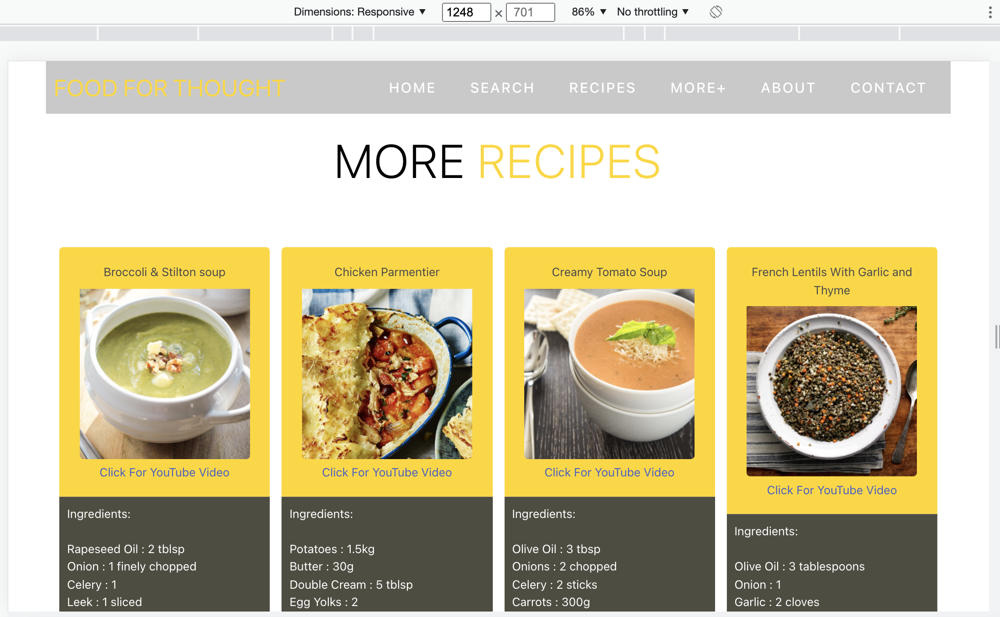

# Project 1: Food For Thought: A Food Recipe Web Application

As a vital part of our journey to being full-stack developers, this project aims to make us use our newly-acquired skills and knowledge that we have gained the past two months of coding bootcamp to build a web application from scratch. 

With our team, we were tasked to conceive and execute a design that solves a real-world problem by integrating data received from multiple server-side API requests. 

Since we will be working collaboratively, this project also aims for us to learn agile development methodologies, as well as implement feature and bug fixes using git branch workflow and pull requests.


## User Story

```
AS A person who enjoys cooking or is learning how to cook, but has a very hectic schedule,

THE USER WANTS a web application that will allow him or her to find food recipes by ingredients,

SO THAT the user will find recipes that will allow him or her to use ingredients available in his or her pantry or refrigerator, and that the he or she can easily follow with as little amount of time as possible.
```

## Acceptance Criteria

```
GIVEN the user is looking for a recipe with an available ingredient,
WHEN the user enters the name of the ingredient in the search field
THEN the user is presented with a recipe using the ingredient
WHEN the user scrolls down the page
THEN the user is presented with more recipes using the same ingredient
WHEN the user clicks the video link below the recipe
THEN the user is directed to a video that shows how to cook the recipe
WHEN the application does not have an available recipe for a certain ingredient
THEN an image will appear stating there is no such recipe 
WHEN the application does not have a video for a recipe
THEN the words "No Video Available" will appear 
WHEN the user clicks the link the user is directed to a placeholder video
WHEN the user enters an ingredient
THEN the user's search history will appear below the search field
WHEN the user wants to review previous recipes
THEN the user can click one of the search words in the search history
THEN the previous recipe using the clicked ingredient will appear
WHEN the user clicks the clear button
THEN all the ingredients in the search history are cleared
WHEN the user clicks the navigation links
THEN the user is immediately directed to the link's corresponding page
WHEN the user views the application on a desktop, tablet, or mobile device
THEN the site is responsive to the different screen sizes.
```

## Description

### What the application does
This project is an interactive web application that allows users to search for recipes with a single word or name of ingredient. While the search button takes the user to the Recipe page which yields the main recipe that coreesponds to the ingredient entered into the search bar, the application also yields other recipes using the same ingredient. These are found in four columns below the main recipe page or the More Recipes page. 

For ease of use, the recipe features a video link to an online video demonstrating how the recipe is cooked. The user can click this link to watch a YouTube video that features the recipe. 

Clicking the navigation links on top immediately takes the user to other sections of the web application: the Search page, Recipes page, More Recipes page, as well as the pages containing information about the development team. Clicking the site title/application name will take the user back to the landing page.

### The technologies used
In developing the application, we have used HTML, CSS, Bulma, and JavaScript.

We have used two server-side APIs from TheMealDB (https://www.themealdb.com), an open, crowd-sourced database of recipes from around the world. These APIs do not require CORS and return JSON data.

While coming from the same source, the two APIs are different. The first API calls the name and image of the recipe, the second API fetches the ingredients, amount of ingredients, videos, and procedures for the recipe that is called. 

Following the requirement of using another CSS framework other than Bootstrap, our team has used Bulma. Bulma is responsible for the creation of main recipe containers and columns for additional recipes, as well as the responsiveness of all Recipe and More Recipes pages when viewed in different devices.

### Some of the challenges we faced and features we hope to implement in the future.

<c/o Jason >

When it comes to implementing Bulma in the framework, one of the challenges we have had is learning to use a new framework and applying it to the current framework and design within a very short period of time. 

In order not to waste any time, our team watched Bulma crash course videos and other tutorials online while building and designing the application. This way we were able to immediately apply what we were learning from the tutorials while troubleshooting any issues.


## Table of Contents

- [User Story] (#user story)
- [Acceptance Criteria] (#acceptance criteria)
- [Description] (#description)
- [Installation] (#installation)
- [Usage] (#usage)
- [Roadmap] (#authors)
- [Authors] (#authors)
- [Credits] (#credits)
- [License] (#license)

## Installation

The application runs in a browser and can be viewed at: https://jasonjayoo.github.io/Our-Project-1/. 

The application's HTML, CSS, JS, images, and README files can be accessed from this repository: https://github.com/jasonjayoo/Our-Project-1.

The application has the following interface:

  


## Usage

Food is important for our body and mind's nourishment. Thus, the easy preparation of meals is a real-world problem all the more redefined by our fast-changing lifestyles, hectic schedules, and more recently, the pandemic, which made people cook and experiment more in their kitchens while at the same time being presented with scarcity and unavailability of certain ingredients. Fast forward to the lifting of the quarantine which made every one go back to their old routine or start a new one, this event still saw a lot of people striving to make quick and easy meals in the comforts of their own homes. 

This web application enables such a user, who can be a beginner or a seasoned cook, with a hectic schedule or just looking for a quick but nourishing meal, to search for recipes using a single ingredient that is available in his or her pantry or refrigerator.


### Project requirements

In accordance with the project requirements, the application has the following features:

1. A design that solves a real-world problem by integrating data received from multiple server-side API requests. 

2. Interactive, i.e., it accepts and responds to user input.

3.  Makes use of Bulma, which is a CSS framework other than Bootstrap.

4. Uses at least two server-side APIs.

5. Does not use alerts, confirms, or prompts.

6. Uses client-side storage to store persistent data.

7. Responsive.

8. A polished UI.

9. A quality README file and GitHub repository. 

### Functionalities based on the acceptance criteria we have developed

In accordance with the acceptance criteria we have developed for the project, the application has the following functionalities:

1. A landing page that contains a Search Now button that directs a user to the search page;


2. A search page containing the search field and search buttons that allow a user to search for recipes by entering a word or the name of an ingredient.

3. A search history that lists all previous word or ingredient searches. The user can view a previously searched recipe by clicking an ingredient in the search history.

4. A clear button that clears the search history container. 


5. A main recipe page which contains the top recipe for the searched ingredient. The recipe includes an image of the recipe, list of ingredients, instructions, and a link to an online video showing how the recipe is cooked.


6. By clicking the YouTube link below the image of the recipe, the user is directed to an online video showing how the recipe is cooked. When there is no available video for the recipe, the words "No Available Video" appears. 

7. When there is no available recipe, an image that says "No Recipe Found Please Try a Different Ingredient" appears, as well as a link to a placeholder video. 


8. A More Recipes page, which can be accessed by scrolling down the application or clicking the More+ link on the navigation bar, presents the user with additional recipes using the ingredient he or she entered into the search field.


9. An About page which contains information about the team.


10. A page containing the team's contact information and social media accounts.


11. A navigation bar that contains the words Food for Thought, the name of the site/application, as well as the following links: Home, Search, Recipe, More+, About, Contact. Clicking any of the links directly takes the user to the link's corresponding page, while clicking the site name will take the user back to the landing page.


12. Responsiveness. The application is responsive when viewed in different-sized screens or devices.





Mobile device (iPhone13)


Tablets


## Roadmap
<c/o Jason>

## Authors
Jane Tiglao
Jason Yoo

## Credits

The following references, websites, and other resources were consulted and/or used in the development of this project:

* [TheMealDB](https://www.themealdb.com/)

* [YouTube](https://www.youtube.com/)

* [Server-side APIs](https://en.wikipedia.org/wiki/Web_API)

* [Git branching workflow](https://git-scm.com/book/en/v2/Git-Branching-Branching-Workflows)

* [Agile software development](https://en.wikipedia.org/wiki/Agile_software_development)

* [Bulma](https://bulma.io/documentation/)

* [Bulma CSS Framework Crash Course](https://www.youtube.com/watch?v=IiPQYQT2-wg)

* [Bulma Layouts - Sections, Containers, Columns, and Levels](https://www.youtube.com/watch?v=ouI1_tZ1yK4)

* [Fontawesome](https://fontawesome.com/)

* [cdnjs](https://cdnjs.com/)


## License
<c/o Jason>